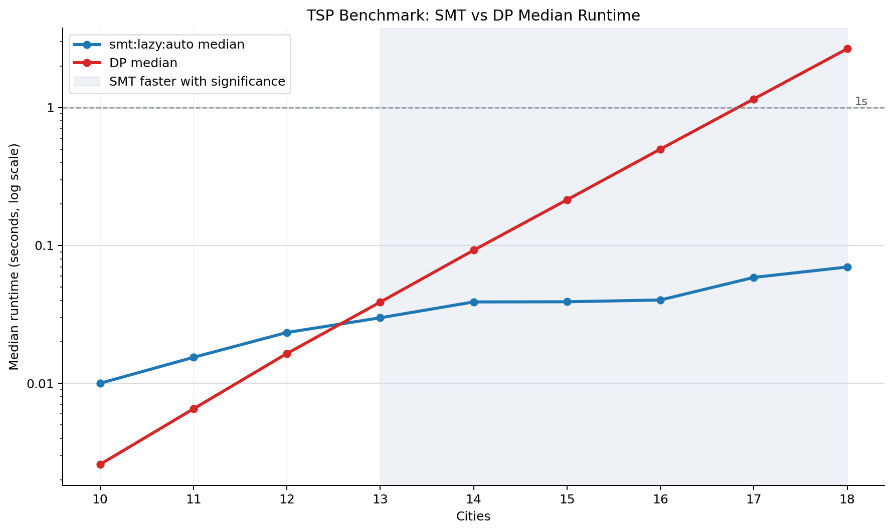

# TSP Benchmark Run

- Run ID: `20260608T121054Z-6f96b5d7`
- Commit: `293fc8b`
- Candidate solver: `smt:lazy:auto`
- CLI invocation: `/tmp/sat-venv/bin/python benchmark.py --min-size 10 --max-size 18 --iterations 30 --seed 2 --dp-max-size 18 --smt-strategies lazy --smt-objectives auto --smt-timeout-ms 60000 --no-plot --csv results/data/benchmark-20260608T121054Z-6f96b5d7.csv`
- Raw CSV: `results/data/benchmark-20260608T121054Z-6f96b5d7.csv`
- Summary CSV: `results/data/benchmark-20260608T121054Z-6f96b5d7-summary.csv`
- Comparison CSV: `results/data/benchmark-20260608T121054Z-6f96b5d7-comparisons.csv`

## Parameters

- dp_max_size: `18`
- iterations: `30`
- max_size: `18`
- min_size: `10`
- seed: `2`
- smt_objectives: `auto`
- smt_strategies: `lazy`
- smt_timeout_ms: `60000`
- target: `benchmark`

## Solver Timing Summary

| solver | size | attempts | ok | failures | median_seconds | mean_seconds | min_seconds | max_seconds |
| --- | --- | --- | --- | --- | --- | --- | --- | --- |
| dp | 10 | 30 | 30 | 0 | 0.00258619 | 0.00262318 | 0.00247838 | 0.00292096 |
| dp | 11 | 30 | 30 | 0 | 0.00653563 | 0.00713548 | 0.00633333 | 0.0105878 |
| dp | 12 | 30 | 30 | 0 | 0.0164558 | 0.0170276 | 0.0159558 | 0.0211942 |
| dp | 13 | 30 | 30 | 0 | 0.0388234 | 0.0390517 | 0.0377211 | 0.0415335 |
| dp | 14 | 30 | 30 | 0 | 0.0923504 | 0.092072 | 0.0890543 | 0.0941711 |
| dp | 15 | 30 | 30 | 0 | 0.214254 | 0.214312 | 0.210095 | 0.221132 |
| dp | 16 | 30 | 30 | 0 | 0.499366 | 0.499612 | 0.490656 | 0.509156 |
| dp | 17 | 30 | 30 | 0 | 1.15311 | 1.1566 | 1.13472 | 1.22988 |
| dp | 18 | 30 | 30 | 0 | 2.66414 | 2.67003 | 2.61222 | 2.76271 |
| smt:lazy:auto | 10 | 30 | 30 | 0 | 0.0100176 | 0.0120872 | 0.00716417 | 0.0234572 |
| smt:lazy:auto | 11 | 30 | 30 | 0 | 0.0154425 | 0.0180222 | 0.00909242 | 0.0418224 |
| smt:lazy:auto | 12 | 30 | 30 | 0 | 0.0233805 | 0.0282295 | 0.0109735 | 0.0721425 |
| smt:lazy:auto | 13 | 30 | 30 | 0 | 0.029898 | 0.0322082 | 0.0126028 | 0.0818499 |
| smt:lazy:auto | 14 | 30 | 30 | 0 | 0.0389496 | 0.0445596 | 0.017661 | 0.185938 |
| smt:lazy:auto | 15 | 30 | 30 | 0 | 0.0390562 | 0.0409995 | 0.0200098 | 0.0878542 |
| smt:lazy:auto | 16 | 30 | 30 | 0 | 0.0402257 | 0.0487772 | 0.0212413 | 0.125533 |
| smt:lazy:auto | 17 | 30 | 30 | 0 | 0.058646 | 0.074855 | 0.0265664 | 0.328346 |
| smt:lazy:auto | 18 | 30 | 30 | 0 | 0.0697531 | 0.0799801 | 0.032776 | 0.195722 |

## Paired DP vs SMT Significance

| size | paired_instances | dp_median_seconds | candidate_median_seconds | median_speedup | speedup_ci_low | speedup_ci_high | smt_wins | dp_wins | sign_test_p_value | verdict |
| --- | --- | --- | --- | --- | --- | --- | --- | --- | --- | --- |
| 10 | 30 | 0.00258619 | 0.0100176 | 0.27647 | 0.210851 | 0.290673 | 0 | 30 | 1 | FAIL |
| 11 | 30 | 0.00653563 | 0.0154425 | 0.44476 | 0.348344 | 0.556861 | 0 | 30 | 1 | FAIL |
| 12 | 30 | 0.0164558 | 0.0233805 | 0.700712 | 0.542976 | 0.849783 | 7 | 23 | 0.999285 | FAIL |
| 13 | 30 | 0.0388234 | 0.029898 | 1.30566 | 1.1875 | 1.50861 | 24 | 6 | 0.000715453 | PASS |
| 14 | 30 | 0.0923504 | 0.0389496 | 2.3726 | 2.06278 | 2.89579 | 29 | 1 | 2.8871e-08 | PASS |
| 15 | 30 | 0.214254 | 0.0390562 | 5.47012 | 4.6641 | 7.50078 | 30 | 0 | 9.31323e-10 | PASS |
| 16 | 30 | 0.499366 | 0.0402257 | 12.5788 | 10.022 | 15.421 | 30 | 0 | 9.31323e-10 | PASS |
| 17 | 30 | 1.15311 | 0.058646 | 19.6805 | 14.9457 | 25.1666 | 30 | 0 | 9.31323e-10 | PASS |
| 18 | 30 | 2.66414 | 0.0697531 | 38.2896 | 30.2776 | 45.0363 | 30 | 0 | 9.31323e-10 | PASS |

## Environment

- Python: `3.9.6 (default, Apr 17 2026, 18:15:52)  [Clang 21.0.0 (clang-2100.1.1.101)]`
- Python executable: `/private/tmp/sat-venv/bin/python`
- Platform: `macOS-26.5-arm64-arm-64bit`
- Z3: `4.16.0`
