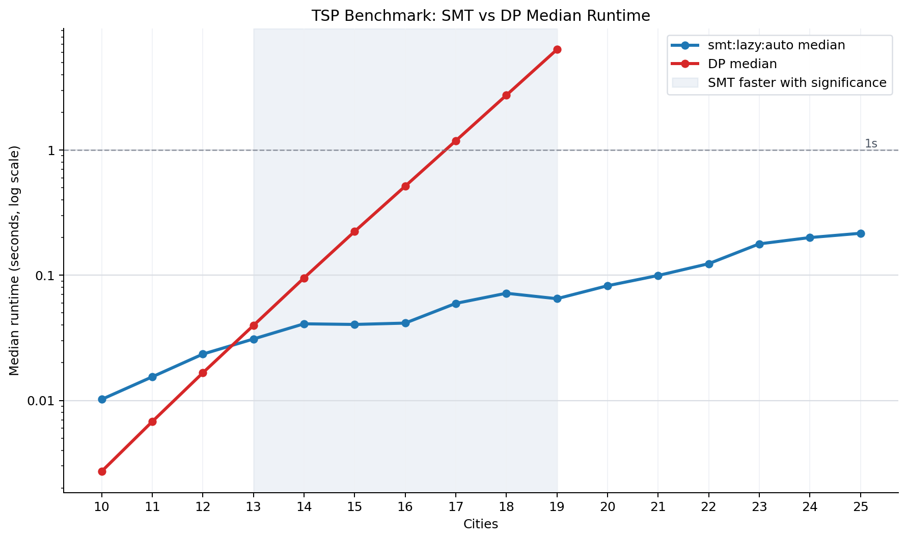

# TSP Benchmark Run

- Run ID: `20260608T140114Z-a0dbd9fe`
- Commit: `293fc8b`
- Candidate solver: `smt:lazy:auto`
- CLI invocation: `/tmp/sat-venv/bin/python benchmark.py --min-size 10 --max-size 25 --iterations 30 --seed 2 --global-timeout-seconds 300 --smt-strategies lazy --smt-objectives auto --smt-timeout-ms 0 --no-plot --csv results/data/benchmark-20260608T140114Z-a0dbd9fe.csv`
- Raw CSV: `results/data/benchmark-20260608T140114Z-a0dbd9fe.csv`
- Summary CSV: `results/data/benchmark-20260608T140114Z-a0dbd9fe-summary.csv`
- Comparison CSV: `results/data/benchmark-20260608T140114Z-a0dbd9fe-comparisons.csv`

## Parameters

- global_timeout_seconds: `300`
- iterations: `30`
- max_size: `25`
- min_size: `10`
- seed: `2`
- smt_objectives: `auto`
- smt_strategies: `lazy`
- smt_timeout_ms: `0`
- target: `benchmark`

## Solver Timing Summary

| solver | size | attempts | ok | failures | median_seconds | mean_seconds | min_seconds | max_seconds |
| --- | --- | --- | --- | --- | --- | --- | --- | --- |
| dp | 10 | 30 | 30 | 0 | 0.00271387 | 0.00273799 | 0.00253021 | 0.00296154 |
| dp | 11 | 30 | 30 | 0 | 0.00677892 | 0.00689875 | 0.00640771 | 0.00878679 |
| dp | 12 | 30 | 30 | 0 | 0.0166148 | 0.0168284 | 0.0161044 | 0.0198971 |
| dp | 13 | 30 | 30 | 0 | 0.0397004 | 0.0401228 | 0.0385003 | 0.0438389 |
| dp | 14 | 30 | 30 | 0 | 0.0951371 | 0.0971532 | 0.0920188 | 0.118373 |
| dp | 15 | 30 | 30 | 0 | 0.223541 | 0.225778 | 0.217415 | 0.272841 |
| dp | 16 | 30 | 30 | 0 | 0.514216 | 0.520657 | 0.507085 | 0.575578 |
| dp | 17 | 30 | 30 | 0 | 1.18479 | 1.19174 | 1.16782 | 1.27227 |
| dp | 18 | 30 | 30 | 0 | 2.74022 | 2.74814 | 2.69913 | 2.82991 |
| dp | 19 | 30 | 24 | 6 | 6.34403 | 6.35909 | 6.24499 | 6.5509 |
| dp | 20 | 30 | 0 | 30 |  |  |  |  |
| dp | 21 | 30 | 0 | 30 |  |  |  |  |
| dp | 22 | 30 | 0 | 30 |  |  |  |  |
| dp | 23 | 30 | 0 | 30 |  |  |  |  |
| dp | 24 | 30 | 0 | 30 |  |  |  |  |
| dp | 25 | 30 | 0 | 30 |  |  |  |  |
| smt:lazy:auto | 10 | 30 | 30 | 0 | 0.0101976 | 0.0132549 | 0.007292 | 0.0264593 |
| smt:lazy:auto | 11 | 30 | 30 | 0 | 0.0154375 | 0.0177687 | 0.00948708 | 0.0440278 |
| smt:lazy:auto | 12 | 30 | 30 | 0 | 0.0234459 | 0.0277286 | 0.0112811 | 0.0760839 |
| smt:lazy:auto | 13 | 30 | 30 | 0 | 0.0309521 | 0.0331899 | 0.0134606 | 0.083054 |
| smt:lazy:auto | 14 | 30 | 30 | 0 | 0.0409383 | 0.0473477 | 0.017927 | 0.19814 |
| smt:lazy:auto | 15 | 30 | 30 | 0 | 0.0404624 | 0.0433144 | 0.0209195 | 0.0915507 |
| smt:lazy:auto | 16 | 30 | 30 | 0 | 0.0414695 | 0.0509206 | 0.0215958 | 0.128666 |
| smt:lazy:auto | 17 | 30 | 30 | 0 | 0.0595749 | 0.0758074 | 0.0273393 | 0.325014 |
| smt:lazy:auto | 18 | 30 | 30 | 0 | 0.0718088 | 0.081246 | 0.0324494 | 0.199562 |
| smt:lazy:auto | 19 | 30 | 30 | 0 | 0.0649508 | 0.219621 | 0.0347225 | 3.93554 |
| smt:lazy:auto | 20 | 30 | 30 | 0 | 0.0824358 | 0.0966631 | 0.041318 | 0.33951 |
| smt:lazy:auto | 21 | 30 | 30 | 0 | 0.0995119 | 0.315325 | 0.0432318 | 2.97064 |
| smt:lazy:auto | 22 | 30 | 30 | 0 | 0.123654 | 0.207938 | 0.0521513 | 0.972582 |
| smt:lazy:auto | 23 | 30 | 30 | 0 | 0.177993 | 1.0145 | 0.0579545 | 19.1185 |
| smt:lazy:auto | 24 | 30 | 30 | 0 | 0.19994 | 2.35532 | 0.0681589 | 59.4313 |
| smt:lazy:auto | 25 | 30 | 30 | 0 | 0.216331 | 4.12371 | 0.0806344 | 67.6088 |

## Paired DP vs SMT Significance

| size | paired_instances | dp_median_seconds | candidate_median_seconds | median_speedup | speedup_ci_low | speedup_ci_high | smt_wins | dp_wins | sign_test_p_value | verdict |
| --- | --- | --- | --- | --- | --- | --- | --- | --- | --- | --- |
| 10 | 30 | 0.00271387 | 0.0101976 | 0.258399 | 0.190246 | 0.28736 | 0 | 30 | 1 | FAIL |
| 11 | 30 | 0.00677892 | 0.0154375 | 0.437893 | 0.350591 | 0.557831 | 0 | 30 | 1 | FAIL |
| 12 | 30 | 0.0166148 | 0.0234459 | 0.711919 | 0.546395 | 0.84469 | 7 | 23 | 0.999285 | FAIL |
| 13 | 30 | 0.0397004 | 0.0309521 | 1.2792 | 1.16714 | 1.46518 | 25 | 5 | 0.000162457 | PASS |
| 14 | 30 | 0.0951371 | 0.0409383 | 2.31204 | 2.05125 | 2.9465 | 29 | 1 | 2.8871e-08 | PASS |
| 15 | 30 | 0.223541 | 0.0404624 | 5.41864 | 4.75748 | 7.05227 | 30 | 0 | 9.31323e-10 | PASS |
| 16 | 30 | 0.514216 | 0.0414695 | 12.565 | 9.41851 | 15.8719 | 30 | 0 | 9.31323e-10 | PASS |
| 17 | 30 | 1.18479 | 0.0595749 | 20.4545 | 15.2028 | 25.1087 | 30 | 0 | 9.31323e-10 | PASS |
| 18 | 30 | 2.74022 | 0.0718088 | 38.04 | 30.762 | 45.5314 | 30 | 0 | 9.31323e-10 | PASS |
| 19 | 24 | 6.34403 | 0.0679318 | 92.9792 | 70.4701 | 117.782 | 24 | 0 | 5.96046e-08 | PASS |

## Environment

- Python: `3.9.6 (default, Apr 17 2026, 18:15:52)  [Clang 21.0.0 (clang-2100.1.1.101)]`
- Python executable: `/private/tmp/sat-venv/bin/python`
- Platform: `macOS-26.5-arm64-arm-64bit`
- Z3: `4.16.0`
