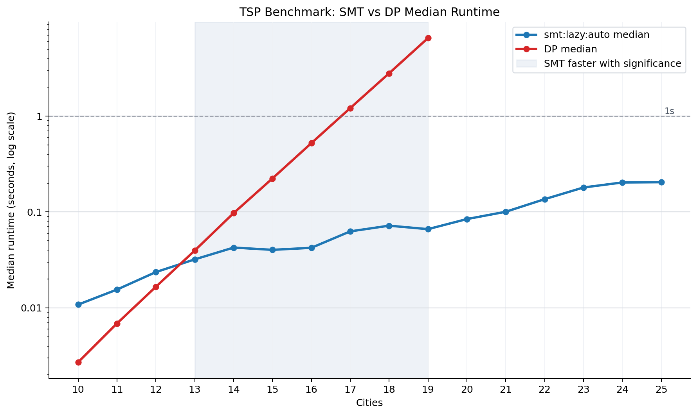

# TSP Benchmark Run

- Run ID: `20260608T142445Z-24db3deb`
- Commit: `293fc8b`
- Candidate solver: `smt:lazy:auto`
- CLI invocation: `/tmp/sat-venv/bin/python benchmark.py --min-size 10 --max-size 25 --iterations 30 --seed 2 --global-timeout-seconds 300 --smt-strategies lazy --smt-objectives auto --smt-timeout-ms 0 --no-plot --csv results/data/benchmark-20260608T142445Z-24db3deb.csv`
- Raw CSV: `results/data/benchmark-20260608T142445Z-24db3deb.csv`
- Summary CSV: `results/data/benchmark-20260608T142445Z-24db3deb-summary.csv`
- Comparison CSV: `results/data/benchmark-20260608T142445Z-24db3deb-comparisons.csv`

## Parameters

- global_timeout_seconds: `300`
- iterations: `30`
- max_size: `25`
- min_size: `10`
- seed: `2`
- smt_objectives: `auto`
- smt_strategies: `lazy`
- smt_timeout_ms: `0`
- target: `benchmark`

## Solver Timing Summary

| solver | size | attempts | ok | failures | median_seconds | mean_seconds | min_seconds | max_seconds |
| --- | --- | --- | --- | --- | --- | --- | --- | --- |
| dp | 10 | 30 | 30 | 0 | 0.00270919 | 0.00273869 | 0.00252137 | 0.0031585 |
| dp | 11 | 30 | 30 | 0 | 0.00688494 | 0.0070735 | 0.00649308 | 0.0085455 |
| dp | 12 | 30 | 30 | 0 | 0.0165904 | 0.0168789 | 0.0159942 | 0.01945 |
| dp | 13 | 30 | 30 | 0 | 0.0396328 | 0.0399387 | 0.0385188 | 0.0426563 |
| dp | 14 | 30 | 30 | 0 | 0.0973278 | 0.0990152 | 0.0909209 | 0.117543 |
| dp | 15 | 30 | 30 | 0 | 0.22402 | 0.225674 | 0.215093 | 0.278938 |
| dp | 16 | 30 | 30 | 0 | 0.522377 | 0.522352 | 0.49785 | 0.585521 |
| dp | 17 | 30 | 30 | 0 | 1.21173 | 1.21687 | 1.15826 | 1.34682 |
| dp | 18 | 30 | 30 | 0 | 2.79658 | 2.79944 | 2.68586 | 2.95822 |
| dp | 19 | 30 | 23 | 7 | 6.5095 | 6.54972 | 6.32725 | 6.83572 |
| dp | 20 | 30 | 0 | 30 |  |  |  |  |
| dp | 21 | 30 | 0 | 30 |  |  |  |  |
| dp | 22 | 30 | 0 | 30 |  |  |  |  |
| dp | 23 | 30 | 0 | 30 |  |  |  |  |
| dp | 24 | 30 | 0 | 30 |  |  |  |  |
| dp | 25 | 30 | 0 | 30 |  |  |  |  |
| smt:lazy:auto | 10 | 30 | 30 | 0 | 0.0108198 | 0.0132503 | 0.00786892 | 0.0250195 |
| smt:lazy:auto | 11 | 30 | 30 | 0 | 0.0155221 | 0.0185304 | 0.00976696 | 0.0469892 |
| smt:lazy:auto | 12 | 30 | 30 | 0 | 0.0236212 | 0.0281497 | 0.0112624 | 0.0767049 |
| smt:lazy:auto | 13 | 30 | 30 | 0 | 0.0320428 | 0.0333217 | 0.0131297 | 0.0808617 |
| smt:lazy:auto | 14 | 30 | 30 | 0 | 0.0425534 | 0.0484746 | 0.0184608 | 0.214243 |
| smt:lazy:auto | 15 | 30 | 30 | 0 | 0.0402877 | 0.0429794 | 0.0208553 | 0.090256 |
| smt:lazy:auto | 16 | 30 | 30 | 0 | 0.0423 | 0.051525 | 0.0212762 | 0.127549 |
| smt:lazy:auto | 17 | 30 | 30 | 0 | 0.0627774 | 0.0788466 | 0.0299839 | 0.344541 |
| smt:lazy:auto | 18 | 30 | 30 | 0 | 0.0719797 | 0.0836193 | 0.0330414 | 0.198282 |
| smt:lazy:auto | 19 | 30 | 30 | 0 | 0.0662348 | 0.223617 | 0.0353555 | 3.97735 |
| smt:lazy:auto | 20 | 30 | 30 | 0 | 0.0843348 | 0.0987365 | 0.0442533 | 0.345853 |
| smt:lazy:auto | 21 | 30 | 30 | 0 | 0.100531 | 0.318924 | 0.0438208 | 2.9997 |
| smt:lazy:auto | 22 | 30 | 30 | 0 | 0.135981 | 0.218822 | 0.0509377 | 1.05021 |
| smt:lazy:auto | 23 | 30 | 30 | 0 | 0.180063 | 1.0279 | 0.0575745 | 19.411 |
| smt:lazy:auto | 24 | 30 | 30 | 0 | 0.203199 | 2.39626 | 0.0696283 | 60.4385 |
| smt:lazy:auto | 25 | 30 | 30 | 0 | 0.204394 | 4.02645 | 0.0835803 | 65.8048 |

## Paired DP vs SMT Significance

| size | paired_instances | dp_median_seconds | candidate_median_seconds | median_speedup | speedup_ci_low | speedup_ci_high | smt_wins | dp_wins | sign_test_p_value | verdict |
| --- | --- | --- | --- | --- | --- | --- | --- | --- | --- | --- |
| 10 | 30 | 0.00270919 | 0.0108198 | 0.242661 | 0.20414 | 0.286685 | 0 | 30 | 1 | FAIL |
| 11 | 30 | 0.00688494 | 0.0155221 | 0.440928 | 0.349804 | 0.549922 | 0 | 30 | 1 | FAIL |
| 12 | 30 | 0.0165904 | 0.0236212 | 0.688973 | 0.553641 | 0.850319 | 6 | 24 | 0.999838 | FAIL |
| 13 | 30 | 0.0396328 | 0.0320428 | 1.26334 | 1.18183 | 1.47927 | 23 | 7 | 0.00261144 | PASS |
| 14 | 30 | 0.0973278 | 0.0425534 | 2.36187 | 2.04767 | 2.85608 | 29 | 1 | 2.8871e-08 | PASS |
| 15 | 30 | 0.22402 | 0.0402877 | 5.54983 | 4.74801 | 7.32621 | 30 | 0 | 9.31323e-10 | PASS |
| 16 | 30 | 0.522377 | 0.0423 | 12.5168 | 9.13679 | 15.4414 | 30 | 0 | 9.31323e-10 | PASS |
| 17 | 30 | 1.21173 | 0.0627774 | 19.543 | 14.7373 | 25.3321 | 30 | 0 | 9.31323e-10 | PASS |
| 18 | 30 | 2.79658 | 0.0719797 | 38.3227 | 31.2843 | 45.3278 | 30 | 0 | 9.31323e-10 | PASS |
| 19 | 23 | 6.5095 | 0.0697982 | 92.2723 | 67.7507 | 106.217 | 23 | 0 | 1.19209e-07 | PASS |

## Environment

- Python: `3.9.6 (default, Apr 17 2026, 18:15:52)  [Clang 21.0.0 (clang-2100.1.1.101)]`
- Python executable: `/private/tmp/sat-venv/bin/python`
- Platform: `macOS-26.5-arm64-arm-64bit`
- Z3: `4.16.0`
