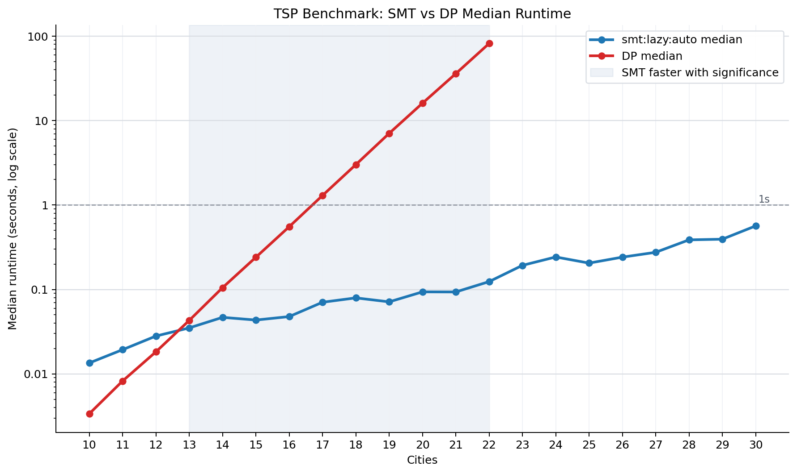

# TSP Benchmark Run

- Run ID: `20260608T183011Z-51cbf999`
- Commit: `094ea53`
- Candidate solver: `smt:lazy:auto`
- CLI invocation: `/tmp/sat-venv/bin/python benchmark.py --min-size 10 --max-size 30 --iterations 30 --seed 2 --dp-max-size 0 --stop-dp-after-timeout --global-timeout-seconds 0 --problem-timeout-seconds 300 --dp-size-timeout-seconds 300 --smt-strategies lazy --smt-objectives auto --smt-timeout-ms 0 --dp-workers 4 --smt-workers 4 --no-overlap-dp-with-smt --no-plot --csv results/data/benchmark-20260608T183011Z-51cbf999.csv`
- Raw CSV: `results/data/benchmark-20260608T183011Z-51cbf999.csv`
- Summary CSV: `results/data/benchmark-20260608T183011Z-51cbf999-summary.csv`
- Comparison CSV: `results/data/benchmark-20260608T183011Z-51cbf999-comparisons.csv`

## Parameters

- dp_max_size: `0`
- dp_size_timeout_seconds: `300`
- dp_workers: `4`
- global_timeout_seconds: `0`
- iterations: `30`
- max_size: `30`
- min_size: `10`
- overlap_dp_with_smt: `false`
- problem_timeout_seconds: `300`
- seed: `2`
- smt_objectives: `auto`
- smt_strategies: `lazy`
- smt_timeout_ms: `0`
- smt_workers: `4`
- stop_dp_after_timeout: `true`
- target: `benchmark`

## Solver Timing Summary

| solver | size | attempts | ok | failures | status_counts | median_seconds | mean_seconds | min_seconds | max_seconds |
| --- | --- | --- | --- | --- | --- | --- | --- | --- | --- |
| dp | 10 | 30 | 30 | 0 | ok:30 | 0.00337123 | 0.00337993 | 0.00313475 | 0.00349933 |
| dp | 11 | 30 | 30 | 0 | ok:30 | 0.00824154 | 0.00814253 | 0.00755296 | 0.00872279 |
| dp | 12 | 30 | 30 | 0 | ok:30 | 0.018256 | 0.0183167 | 0.0180053 | 0.0189184 |
| dp | 13 | 30 | 30 | 0 | ok:30 | 0.0429849 | 0.0429566 | 0.0415193 | 0.0444403 |
| dp | 14 | 30 | 30 | 0 | ok:30 | 0.105021 | 0.104645 | 0.100642 | 0.106322 |
| dp | 15 | 30 | 30 | 0 | ok:30 | 0.24075 | 0.240817 | 0.232149 | 0.261064 |
| dp | 16 | 30 | 30 | 0 | ok:30 | 0.55348 | 0.552193 | 0.529039 | 0.560369 |
| dp | 17 | 30 | 30 | 0 | ok:30 | 1.29767 | 1.2939 | 1.23927 | 1.31939 |
| dp | 18 | 30 | 30 | 0 | ok:30 | 3.01034 | 3.0071 | 2.83459 | 3.0838 |
| dp | 19 | 30 | 30 | 0 | ok:30 | 7.05813 | 7.03549 | 6.59568 | 7.20333 |
| dp | 20 | 30 | 30 | 0 | ok:30 | 16.0643 | 16.0656 | 15.1896 | 16.973 |
| dp | 21 | 30 | 30 | 0 | ok:30 | 36.0044 | 35.9061 | 34.2526 | 36.7788 |
| dp | 22 | 30 | 12 | 18 | ok:12, size_timeout:1, skipped_after_timeout:17 | 81.9059 | 81.8292 | 80.4207 | 82.5428 |
| dp | 23 | 30 | 0 | 30 | skipped_after_timeout:30 |  |  |  |  |
| dp | 24 | 30 | 0 | 30 | skipped_after_timeout:30 |  |  |  |  |
| dp | 25 | 30 | 0 | 30 | skipped_after_timeout:30 |  |  |  |  |
| dp | 26 | 30 | 0 | 30 | skipped_after_timeout:30 |  |  |  |  |
| dp | 27 | 30 | 0 | 30 | skipped_after_timeout:30 |  |  |  |  |
| dp | 28 | 30 | 0 | 30 | skipped_after_timeout:30 |  |  |  |  |
| dp | 29 | 30 | 0 | 30 | skipped_after_timeout:30 |  |  |  |  |
| dp | 30 | 30 | 0 | 30 | skipped_after_timeout:30 |  |  |  |  |
| smt:lazy:auto | 10 | 30 | 30 | 0 | ok:30 | 0.0134704 | 0.0158872 | 0.0100174 | 0.0285077 |
| smt:lazy:auto | 11 | 30 | 30 | 0 | ok:30 | 0.019353 | 0.0214939 | 0.0122109 | 0.0507171 |
| smt:lazy:auto | 12 | 30 | 30 | 0 | ok:30 | 0.02806 | 0.0315825 | 0.0139782 | 0.0848306 |
| smt:lazy:auto | 13 | 30 | 30 | 0 | ok:30 | 0.0350597 | 0.0375204 | 0.0178357 | 0.0838683 |
| smt:lazy:auto | 14 | 30 | 30 | 0 | ok:30 | 0.0467435 | 0.0525266 | 0.0214787 | 0.215704 |
| smt:lazy:auto | 15 | 30 | 30 | 0 | ok:30 | 0.0434316 | 0.0460454 | 0.0234289 | 0.112403 |
| smt:lazy:auto | 16 | 30 | 30 | 0 | ok:30 | 0.0477298 | 0.0554054 | 0.0247523 | 0.13066 |
| smt:lazy:auto | 17 | 30 | 30 | 0 | ok:30 | 0.0705493 | 0.0794673 | 0.0302425 | 0.244277 |
| smt:lazy:auto | 18 | 30 | 30 | 0 | ok:30 | 0.0794964 | 0.0836173 | 0.03447 | 0.140758 |
| smt:lazy:auto | 19 | 30 | 30 | 0 | ok:30 | 0.0713306 | 0.268741 | 0.0412439 | 5.40485 |
| smt:lazy:auto | 20 | 30 | 30 | 0 | ok:30 | 0.0936303 | 0.102694 | 0.0469444 | 0.300752 |
| smt:lazy:auto | 21 | 30 | 30 | 0 | ok:30 | 0.0934119 | 0.355367 | 0.051757 | 4.30456 |
| smt:lazy:auto | 22 | 30 | 30 | 0 | ok:30 | 0.123843 | 0.202878 | 0.0517058 | 1.19805 |
| smt:lazy:auto | 23 | 30 | 30 | 0 | ok:30 | 0.19295 | 1.91521 | 0.0673191 | 45.6218 |
| smt:lazy:auto | 24 | 30 | 30 | 0 | ok:30 | 0.242556 | 1.76413 | 0.0806002 | 43.042 |
| smt:lazy:auto | 25 | 30 | 30 | 0 | ok:30 | 0.205259 | 8.71922 | 0.0895988 | 181.287 |
| smt:lazy:auto | 26 | 30 | 30 | 0 | ok:30 | 0.241493 | 2.73321 | 0.0630602 | 54.8899 |
| smt:lazy:auto | 27 | 30 | 30 | 0 | ok:30 | 0.275476 | 4.22163 | 0.0847675 | 56.0534 |
| smt:lazy:auto | 28 | 30 | 30 | 0 | ok:30 | 0.386893 | 7.51399 | 0.0999647 | 191.1 |
| smt:lazy:auto | 29 | 30 | 30 | 0 | ok:30 | 0.393994 | 0.902914 | 0.0928708 | 9.31132 |
| smt:lazy:auto | 30 | 30 | 27 | 3 | ok:27, problem_timeout:3 | 0.565636 | 5.86978 | 0.139555 | 92.5161 |

## Paired DP vs SMT Significance

| size | paired_instances | dp_median_seconds | candidate_median_seconds | median_speedup | speedup_ci_low | speedup_ci_high | smt_wins | dp_wins | sign_test_p_value | verdict |
| --- | --- | --- | --- | --- | --- | --- | --- | --- | --- | --- |
| 10 | 30 | 0.00337123 | 0.0134704 | 0.248965 | 0.225913 | 0.269179 | 0 | 30 | 1 | FAIL |
| 11 | 30 | 0.00824154 | 0.019353 | 0.421959 | 0.342831 | 0.512022 | 0 | 30 | 1 | FAIL |
| 12 | 30 | 0.018256 | 0.02806 | 0.665101 | 0.484203 | 0.808515 | 5 | 25 | 0.99997 | FAIL |
| 13 | 30 | 0.0429849 | 0.0350597 | 1.23341 | 1.10051 | 1.4229 | 22 | 8 | 0.0080624 | PASS |
| 14 | 30 | 0.105021 | 0.0467435 | 2.24926 | 1.97322 | 2.86747 | 28 | 2 | 4.33996e-07 | PASS |
| 15 | 30 | 0.24075 | 0.0434316 | 5.636 | 4.79873 | 7.06545 | 30 | 0 | 9.31323e-10 | PASS |
| 16 | 30 | 0.55348 | 0.0477298 | 11.6399 | 9.26335 | 15.2478 | 30 | 0 | 9.31323e-10 | PASS |
| 17 | 30 | 1.29767 | 0.0705493 | 18.4839 | 15.0365 | 24.0449 | 30 | 0 | 9.31323e-10 | PASS |
| 18 | 30 | 3.01034 | 0.0794964 | 37.1915 | 29.1954 | 45.405 | 30 | 0 | 9.31323e-10 | PASS |
| 19 | 30 | 7.05813 | 0.0713306 | 99.7129 | 68.5545 | 123.171 | 30 | 0 | 9.31323e-10 | PASS |
| 20 | 30 | 16.0643 | 0.0936303 | 169.051 | 145.673 | 204.326 | 30 | 0 | 9.31323e-10 | PASS |
| 21 | 30 | 36.0044 | 0.0934119 | 383.7 | 224.824 | 437.878 | 30 | 0 | 9.31323e-10 | PASS |
| 22 | 12 | 81.9059 | 0.11044 | 735.2 | 659.729 | 1074.55 | 12 | 0 | 0.000244141 | PASS |

## Environment

- Python: `3.9.6 (default, Apr 17 2026, 18:15:52)  [Clang 21.0.0 (clang-2100.1.1.101)]`
- Python executable: `/private/tmp/sat-venv/bin/python`
- Platform: `macOS-26.5-arm64-arm-64bit`
- Z3: `4.16.0`
