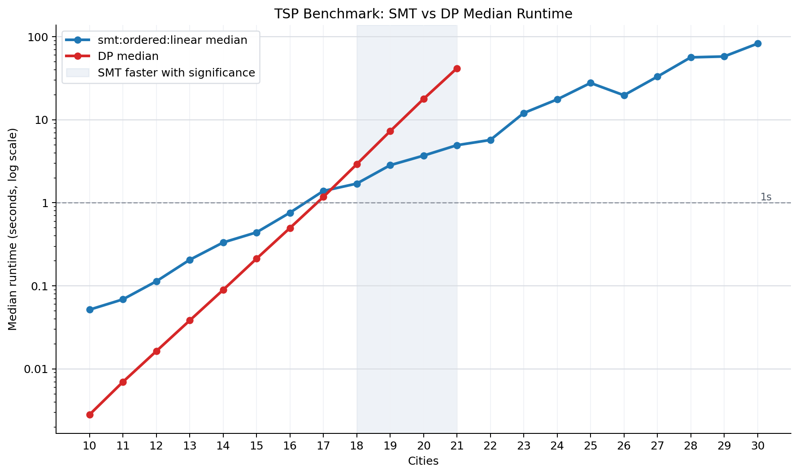

# TSP Benchmark Run

- Run ID: `20260609T043445Z-5a777462`
- Commit: `17a5ddf`
- Candidate solver: `smt:ordered:linear`
- CLI invocation: `/tmp/sat-venv/bin/python benchmark.py --min-size 10 --max-size 30 --iterations 30 --seed 2 --dp-max-size 0 --stop-dp-after-timeout --global-timeout-seconds 0 --problem-timeout-seconds 300 --dp-size-timeout-seconds 300 --smt-strategies ordered --smt-objectives linear --smt-timeout-ms 0 --dp-workers 4 --smt-workers 4 --no-overlap-dp-with-smt --no-plot --csv results/data/benchmark-20260609T043445Z-5a777462.csv`
- Raw CSV: `results/data/benchmark-20260609T043445Z-5a777462.csv`
- Summary CSV: `results/data/benchmark-20260609T043445Z-5a777462-summary.csv`
- Comparison CSV: `results/data/benchmark-20260609T043445Z-5a777462-comparisons.csv`

## Parameters

- dp_max_size: `0`
- dp_size_timeout_seconds: `300`
- dp_workers: `4`
- global_timeout_seconds: `0`
- iterations: `30`
- max_size: `30`
- min_size: `10`
- overlap_dp_with_smt: `false`
- problem_timeout_seconds: `300`
- seed: `2`
- smt_objectives: `linear`
- smt_strategies: `ordered`
- smt_timeout_ms: `0`
- smt_workers: `4`
- stop_dp_after_timeout: `true`
- target: `benchmark`

## Solver Timing Summary

| solver | size | attempts | ok | failures | status_counts | median_seconds | mean_seconds | min_seconds | max_seconds |
| --- | --- | --- | --- | --- | --- | --- | --- | --- | --- |
| dp | 10 | 30 | 30 | 0 | ok:30 | 0.00281508 | 0.00281123 | 0.00268746 | 0.00289238 |
| dp | 11 | 30 | 30 | 0 | ok:30 | 0.00697202 | 0.00696868 | 0.00677038 | 0.00714058 |
| dp | 12 | 30 | 30 | 0 | ok:30 | 0.0163576 | 0.0163367 | 0.0159863 | 0.016666 |
| dp | 13 | 30 | 30 | 0 | ok:30 | 0.0383063 | 0.0384534 | 0.0375067 | 0.039745 |
| dp | 14 | 30 | 30 | 0 | ok:30 | 0.0893808 | 0.0894123 | 0.0867948 | 0.0921682 |
| dp | 15 | 30 | 30 | 0 | ok:30 | 0.212454 | 0.212235 | 0.205537 | 0.217598 |
| dp | 16 | 30 | 30 | 0 | ok:30 | 0.496963 | 0.49561 | 0.473684 | 0.514189 |
| dp | 17 | 30 | 30 | 0 | ok:30 | 1.17412 | 1.16919 | 1.09422 | 1.18799 |
| dp | 18 | 30 | 30 | 0 | ok:30 | 2.91161 | 2.88327 | 2.5737 | 2.96699 |
| dp | 19 | 30 | 30 | 0 | ok:30 | 7.27471 | 7.20799 | 6.43805 | 7.32416 |
| dp | 20 | 30 | 30 | 0 | ok:30 | 17.7905 | 17.7261 | 16.204 | 18.1433 |
| dp | 21 | 30 | 28 | 2 | ok:28, size_timeout:1, skipped_after_timeout:1 | 41.6629 | 41.6347 | 41.3425 | 42.0313 |
| dp | 22 | 30 | 0 | 30 | skipped_after_timeout:30 |  |  |  |  |
| dp | 23 | 30 | 0 | 30 | skipped_after_timeout:30 |  |  |  |  |
| dp | 24 | 30 | 0 | 30 | skipped_after_timeout:30 |  |  |  |  |
| dp | 25 | 30 | 0 | 30 | skipped_after_timeout:30 |  |  |  |  |
| dp | 26 | 30 | 0 | 30 | skipped_after_timeout:30 |  |  |  |  |
| dp | 27 | 30 | 0 | 30 | skipped_after_timeout:30 |  |  |  |  |
| dp | 28 | 30 | 0 | 30 | skipped_after_timeout:30 |  |  |  |  |
| dp | 29 | 30 | 0 | 30 | skipped_after_timeout:30 |  |  |  |  |
| dp | 30 | 30 | 0 | 30 | skipped_after_timeout:30 |  |  |  |  |
| smt:ordered:linear | 10 | 30 | 30 | 0 | ok:30 | 0.051663 | 0.0552351 | 0.0374585 | 0.0888012 |
| smt:ordered:linear | 11 | 30 | 30 | 0 | ok:30 | 0.0687972 | 0.0781853 | 0.0444409 | 0.160135 |
| smt:ordered:linear | 12 | 30 | 30 | 0 | ok:30 | 0.113423 | 0.124969 | 0.0599673 | 0.246087 |
| smt:ordered:linear | 13 | 30 | 30 | 0 | ok:30 | 0.205961 | 0.244101 | 0.112393 | 0.618094 |
| smt:ordered:linear | 14 | 30 | 30 | 0 | ok:30 | 0.332825 | 0.381263 | 0.145749 | 1.26098 |
| smt:ordered:linear | 15 | 30 | 30 | 0 | ok:30 | 0.440531 | 0.463481 | 0.240367 | 0.813219 |
| smt:ordered:linear | 16 | 30 | 30 | 0 | ok:30 | 0.760456 | 0.898261 | 0.341524 | 3.04118 |
| smt:ordered:linear | 17 | 30 | 30 | 0 | ok:30 | 1.38795 | 1.36105 | 0.562123 | 2.77526 |
| smt:ordered:linear | 18 | 30 | 30 | 0 | ok:30 | 1.70267 | 1.86268 | 0.624089 | 4.72787 |
| smt:ordered:linear | 19 | 30 | 30 | 0 | ok:30 | 2.83623 | 3.56536 | 0.953727 | 16.5422 |
| smt:ordered:linear | 20 | 30 | 30 | 0 | ok:30 | 3.6978 | 4.96813 | 1.28123 | 26.2378 |
| smt:ordered:linear | 21 | 30 | 30 | 0 | ok:30 | 4.93943 | 6.54193 | 1.0081 | 38.7746 |
| smt:ordered:linear | 22 | 30 | 30 | 0 | ok:30 | 5.71021 | 6.35832 | 2.50585 | 17.3083 |
| smt:ordered:linear | 23 | 30 | 30 | 0 | ok:30 | 12.0446 | 18.3993 | 2.93676 | 119.358 |
| smt:ordered:linear | 24 | 30 | 29 | 1 | ok:29, problem_timeout:1 | 17.5596 | 24.545 | 9.21372 | 207.513 |
| smt:ordered:linear | 25 | 30 | 29 | 1 | ok:29, problem_timeout:1 | 27.74 | 33.9306 | 14.9925 | 120.076 |
| smt:ordered:linear | 26 | 30 | 29 | 1 | ok:29, problem_timeout:1 | 19.725 | 23.8682 | 2.80539 | 72.246 |
| smt:ordered:linear | 27 | 30 | 30 | 0 | ok:30 | 33.0151 | 33.2462 | 5.01176 | 98.2955 |
| smt:ordered:linear | 28 | 30 | 28 | 2 | ok:28, problem_timeout:2 | 56.428 | 60.9084 | 16.6119 | 147.913 |
| smt:ordered:linear | 29 | 30 | 30 | 0 | ok:30 | 57.789 | 60.627 | 17.9882 | 162.892 |
| smt:ordered:linear | 30 | 30 | 25 | 5 | ok:25, problem_timeout:5 | 82.5994 | 96.6841 | 23.5549 | 220.569 |

## Paired DP vs SMT Significance

| size | paired_instances | dp_median_seconds | candidate_median_seconds | median_speedup | speedup_ci_low | speedup_ci_high | smt_wins | dp_wins | sign_test_p_value | verdict |
| --- | --- | --- | --- | --- | --- | --- | --- | --- | --- | --- |
| 10 | 30 | 0.00281508 | 0.051663 | 0.0544243 | 0.0489041 | 0.0565464 | 0 | 30 | 1 | FAIL |
| 11 | 30 | 0.00697202 | 0.0687972 | 0.101457 | 0.0877022 | 0.109708 | 0 | 30 | 1 | FAIL |
| 12 | 30 | 0.0163576 | 0.113423 | 0.145104 | 0.122349 | 0.161703 | 0 | 30 | 1 | FAIL |
| 13 | 30 | 0.0383063 | 0.205961 | 0.188711 | 0.148839 | 0.213825 | 0 | 30 | 1 | FAIL |
| 14 | 30 | 0.0893808 | 0.332825 | 0.265664 | 0.233926 | 0.311887 | 0 | 30 | 1 | FAIL |
| 15 | 30 | 0.212454 | 0.440531 | 0.481671 | 0.42142 | 0.540187 | 0 | 30 | 1 | FAIL |
| 16 | 30 | 0.496963 | 0.760456 | 0.658213 | 0.53099 | 0.769379 | 4 | 26 | 0.999996 | FAIL |
| 17 | 30 | 1.17412 | 1.38795 | 0.846643 | 0.773022 | 0.920289 | 7 | 23 | 0.999285 | FAIL |
| 18 | 30 | 2.91161 | 1.70267 | 1.71383 | 1.44221 | 2.24745 | 26 | 4 | 2.97381e-05 | PASS |
| 19 | 30 | 7.27471 | 2.83623 | 2.55607 | 1.85485 | 3.23052 | 29 | 1 | 2.8871e-08 | PASS |
| 20 | 30 | 17.7905 | 3.6978 | 4.82213 | 3.82747 | 6.29824 | 29 | 1 | 2.8871e-08 | PASS |
| 21 | 28 | 41.6629 | 4.93943 | 8.41301 | 7.01107 | 11.396 | 28 | 0 | 3.72529e-09 | PASS |

## Environment

- Python: `3.9.6 (default, Apr 17 2026, 18:15:52)  [Clang 21.0.0 (clang-2100.1.1.101)]`
- Python executable: `/private/tmp/sat-venv/bin/python`
- Platform: `macOS-26.5-arm64-arm-64bit`
- Z3: `4.16.0`
